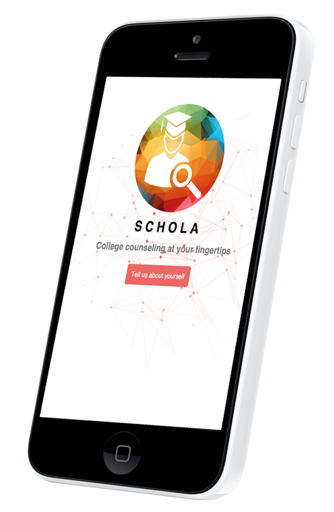
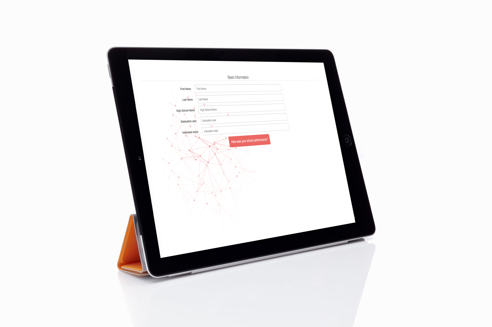
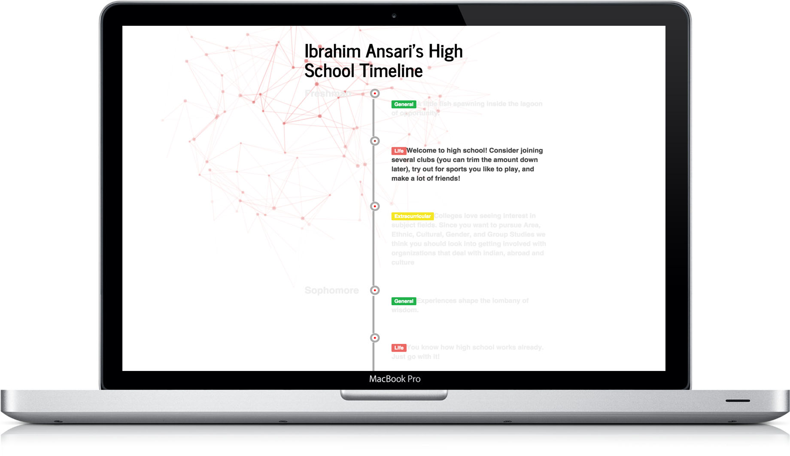

# Schola
Schola is a college counseling web application.
By: Aashia Mehta, Aakash Adesara, Aniket Mandalik

## Functionalities
- [x] The web application initially gathers personal, academic, and extracurricular information from the student, including the college the student aims to attend. 
- [x] User statistics are compared to a college database and user input creates a standard numerical value from 1 - 100 on three categories: extracurriculars, academics, and testing. Since colleges have different criterias for admittance, it was important to create a universal scale in which all colleges are rated.
- [x] User is provided with a high school timeline, which we suggest students follow in order to become a competitive applicant for their desired colleges.

## Images

Here are a few screenshots of the application:

## Notes

College counselors nowadays are expensive and deliver generic information that can be deduced with a bit of research. We created a system that allows users to determine a good path for themselves to take in order to get into the colleges they want to go to. Because college decisions seem to take into account many aspects of a student's life, we had to boil the multiple factors down into what would be most important for a college. We had to weight scores differently based on the college's consideration of various factors like different weighting about grades, extracurriculars, and testing. Agreeing on a weighting system for extracurriculars, academics, and testing was the hardest, and we discussed the topic for over half an hour.

